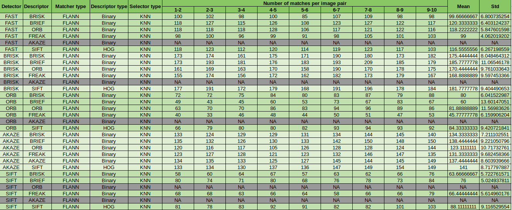
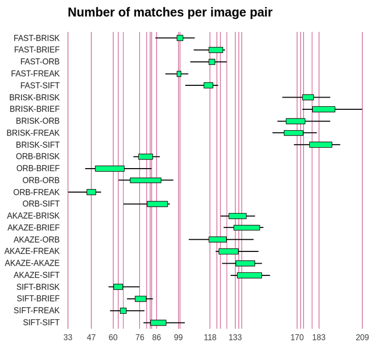
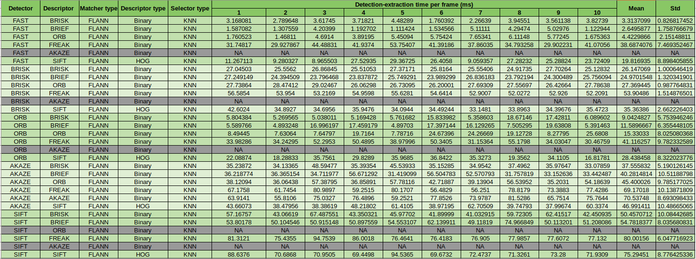
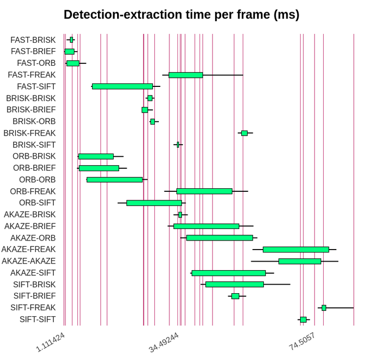

# Feature detection in 2D Comparison (Performance evaluation)

In this section we will compare all detectors and descriptors in order to rank them and select the top 3 combinations between detectors and descriptors for our particular use case.

## Keypoint detection comparison (Performance Evaluation 1)

The Detectors that were analyzed are the following:

### FAST

Here we can see that FAST has only one size of keypoint detection because it is not aware of changes in scale. i.e. It does not implement an image pyramid. It also doesn't provide keypoint orientation. 
### BRISK

BRISK provides orientation and different scale keypoints.
### ORB

ORB implements a modified version of FAST that considers both changes in scale and orientation. Thus, keypoints have different sizes due to being found at different scale levels and also provide orientation information.
### AKAZE

AKAZE provides orientation and different scale keypoints. However, it does not find keypoints at higher level of scales, hence, the small sizes of keypoints.
### SIFT

SIFT provides orientation and different scale keypoints. However, they find keypoints mostly in the image source scale and some on higher levels of the image pyramid.

### Comparison plots (number of keypoints)

A comparison table has been made with all results from the keypoint detection stage for each one of the detectors implemented, as you can see below:

The distribution of each detector is best illustrated with the following boxplots:

From the plots above we can see that the BRISK detector is the algorithm that finds the most keypoints for our use case and that SIFT is very consistent as it has a very small STD which makes it more precise and perhaps reliable for tracking purposes (but it finds way less kepoints than BRISK).

## Number of matched keypoints (Performance Evaluation 2)

From the implementation of different detectors and descriptors we have compiled a series of data. One of them was the number of matches per each combination of detectors and descriptors. The compiled result is shown in the table below:

**Note: ** AKAZE descriptor only works with AKAZE detection, that's why these combinations are gray out from the table.

**Note 2: ** SIFT detector didn't work with ORB descriptor and in general it didn't perform well with other descriptors different to SIFT

**Note 3: ** For this section we performed a FLANN approach using an adaption for HAMMING Norm in case of binary descriptors as explained [here](https://stackoverflow.com/questions/43830849/opencv-use-flann-with-orb-descriptors-to-match-features). The reason was that FLANN performs faster than BFmatcher.

**Note 4: ** We used a threshold of 0.8 for the Nearest Neighbor Distance Ratio in the KNN approach.

To visualize the results obtained in this section, we also produced some boxplots, as shown below:

## Detection-Descriptor time comparison (Performance Evaluation 3)

For the different combinations of detections and descriptors we took the total time between the detection of keypoints and the extraction of features to build a descriptor vector. The results are compiled in the following table:

Once again to visualize the final results, we performed a boxplot comparison as shown below:

## Conclusions 

From all the box plots it seems that the TOP 3 quickes combinations are between the FAST detector with ORB, BRIEF and BRISK. Although ORB-BRISK and ORB-BRIEF are quite closed like in TOP 5 (Performance Evaluation 3 results). However, in terms of matches the best combinations are between BRISK detector and BRISK, BRIEF or SIFT descriptors as they output more than 170 matches in average (Performance Evaluation 2 results).

Nevertheless, if I have to choose I will go with BRISK-BRIEF pair. Since although it is not the quickest combination, it is almost as quick as FAST with ORB, but it gets a lot of matches with very good performance as can be visually seen below:

