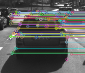
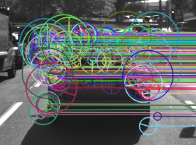
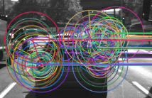
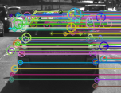
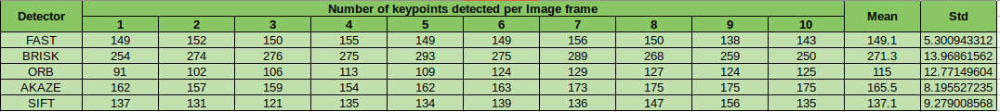
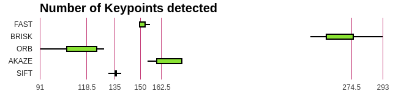

# Feature detection in 2D Comparison (Performance evaluation)

In this section we will compare all detectors and descriptors in order to rank them and select the top 3 combinations between detectors and descriptors for our particular use case.

## Keypoint detection comparison

The Detectors that were analyzed are the following:

### FAST

Here we can see that FAST has only one size of keypoint detection because it is not aware of changes in scale. i.e. It does not implement an image pyramid. It also doesn't provide keypoint orientation. 
### BRISK

BRISK provides orientation and different scale keypoints.
### ORB

ORB implements a modified version of FAST that considers both changes in scale and orientation. Thus, keypoints have different sizes due to being found at different scale levels and also provide orientation information.
### AKAZE

AKAZE provides orientation and different scale keypoints. However, it does not find keypoints at higher level of scales, hence, the small sizes of keypoints.
### SIFT

SIFT provides orientation and different scale keypoints. However, they find keypoints mostly in the image source scale and some on higher levels of the image pyramid.

### Comparison plots (number of keypoints)

A comparison table has been made with all results from the keypoint detection stage for each one of the detectors implemented, as you can see below:

The distribution of each detector is best illustrated with the following boxplots:

## Detection-Descriptor comparison