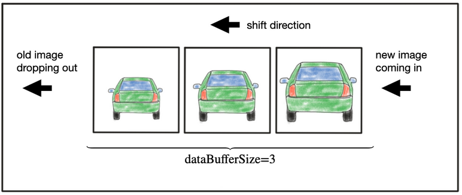

# Camera based 2D Feature Tracking


The idea of the final project is to build a collision detection system - that's the overall goal for the Final Project. As a preparation for this, we will build the feature tracking part and test various detector / descriptor combinations to see which ones perform best. Thus, this project consists of four parts:

* First, we focus on loading images, setting up data structures and putting everything into a ring buffer to optimize memory load. 
* Then, we integrate several keypoint detectors such as HARRIS, FAST, BRISK and SIFT and compare them with regard to number of keypoints and speed. 
* In the next part, we focus on descriptor extraction and matching using brute force and also the FLANN approach.
* Finally we test the various algorithms in different combinations and compare them with regard to some performance measures. 

## Dependencies for Running Locally
1. cmake >= 2.8
 * All OSes: [click here for installation instructions](https://cmake.org/install/)

2. make >= 4.1 (Linux, Mac), 3.81 (Windows)
 * Linux: make is installed by default on most Linux distros
 * Mac: [install Xcode command line tools to get make](https://developer.apple.com/xcode/features/)
 * Windows: [Click here for installation instructions](http://gnuwin32.sourceforge.net/packages/make.htm)

3. OpenCV >= 4.1
 * All OSes: refer to the [official instructions](https://docs.opencv.org/master/df/d65/tutorial_table_of_content_introduction.html)
 * This must be compiled from source using the `-D OPENCV_ENABLE_NONFREE=ON` cmake flag for testing the SIFT and SURF detectors. If using [homebrew](https://brew.sh/): `$> brew install --build-from-source opencv` will install required dependencies and compile opencv with the `opencv_contrib` module by default (no need to set `-DOPENCV_ENABLE_NONFREE=ON` manually). 
 * The OpenCV 4.1.0 source code can be found [here](https://github.com/opencv/opencv/tree/4.1.0)

4. gcc/g++ >= 5.4
  * Linux: gcc / g++ is installed by default on most Linux distros
  * Mac: same deal as make - [install Xcode command line tools](https://developer.apple.com/xcode/features/)
  * Windows: recommend using either [MinGW-w64](http://mingw-w64.org/doku.php/start) or [Microsoft's VCPKG, a C++ package manager](https://docs.microsoft.com/en-us/cpp/build/install-vcpkg?view=msvc-160&tabs=windows). VCPKG maintains its own binary distributions of OpenCV and many other packages. To see what packages are available, type `vcpkg search` at the command prompt. For example, once you've _VCPKG_ installed, you can install _OpenCV 4.1_ with the command:
```bash
c:\vcpkg> vcpkg install opencv4[nonfree,contrib]:x64-windows
```
Then, add *C:\vcpkg\installed\x64-windows\bin* and *C:\vcpkg\installed\x64-windows\debug\bin* to your user's _PATH_ variable. Also, set the _CMake Toolchain File_ to *c:\vcpkg\scripts\buildsystems\vcpkg.cmake*.

### Docker setup

Alternatively you can setup the environment using the dockerfile in this project. To achieve this you can simply do the following steps:

1. Build Dockerfile

    `docker build -t sensor_fusion:feature_detec_2D .`

2. Create container

    ``docker run --name feature_detector_2D -v /tmp/.X11-unix:/tmp/.X11-unix -e DISPLAY=$DISPLAY -v `pwd`:/project -it --env QT_X11_NO_MITSHM=1 --device /dev/dri --privileged --gpus all sensor_fusion:feature_detec_2D``

3. Everytime we want to run container

    `docker start feature_detector_2D`

    `docker exec -it feature_detector_2D bash`


## Basic Build Instructions

1. Clone this repo.
2. Make a build directory in the top level directory: `mkdir build && cd build`
3. Compile: `cmake .. && make`
4. Run it: `./2D_feature_tracking`.


## Project explanation

### Ring buffer

For this project a ring buffer was implemented as illustrated below:



To do this a ring buffer class was created in the following paths: [ringBuffer.cpp](src/ringBuffer.cpp) and [ringBuffer.hpp](src/ringBuffer.hpp) where a vector type is used to create the buffer. The idea was to keep only 2 images at a time, but it could be customized to any other size by setting `dataBufferSize`. This is very helpful because we prevent the algorithm from using too many memory resources from our computer because we drop old images and retain only the k last images in memory. 

### Key point detection

In the keypoint detection section 6 detectors were implemented:

* HARRIS a traditional method that uses eigenvalues to identify corners. For this particular detection NMS was implemented manually as it didn't have this feature out of the box contrary to the detectors below that they already have many features to customize for detection and extraction of keypoints. the following parameters were used on this algorithm:

```
int blockSize = 4;                   //  size of an average block for computing a derivative covariation matrix over each pixel neighborhood
int apertureSize = 3;                // Aperture parameter for the Sobel operator.
double k = 0.04;                     // Harris detector empirical parameter constant which is usually between [0.04, 0.06].
int borderType = cv::BORDER_DEFAULT; // Pixel extrapolation method
int minResponse = 70;                // minimum value for a corner in the 8bit scaled response matrix
double maxOverlap = 0.1;             // max. permissible overlap between two features in ratio [0, 1], used during non-maxima suppression
```

* FAST the following parameters were used on this algorithm and the explanation of each parameter in more detail:
```
int thresh = 30;                                  // threshold parameter to control how different the neighbors are from a proposed pixel to be considered keypoint.
bool nms = true;                                  // boolean to set if we want to apply non max suppression.
cv::FastFeatureDetector::DetectorType detecType = // Type of neighborhood to create TYPE_9_16 (16 pixels around the analyzed pixel and 9 are required to be considered
    cv::FastFeatureDetector::TYPE_9_16;           // a keypoint), TYPE_7_12, TYPE_5_8
```
* BRISK the following parameters were used on this algorithm and the explanation of each parameter in more detail:
```
int thresh = 30;           // AGAST detection threshold score.
int octaves = 3;           // Image pyramid octaves. Image is blurred with different coefficients to obtain an octave space. if 3 then 3 downsamples are done, 0 means no downsample (original image)
float patternScale = 1.0f; // apply this scale to the pattern used for sampling the neighbourhood of a keypoint.
```


* ORB the following parameters were used on this algorithm and the explanation of each parameter in more detail:
```
int nfeatures = 500;           // The maximum number of features to retain.
float scaleFactor = 1.2f;      // Pyramid decimation ratio, greater than 1. scaleFactor==2 means the classical pyramid
int nlevels = 8;               // The number of pyramid levels.
int edgeThreshold = 31;        // This is size of the border where the features are not detected. It should roughly match the patchSize parameter.
int firstLevel = 0;            // The level of pyramid to put source image to. Previous layers are filled with upscaled source image.
int WTA_K = 2;                 // The number of points that produce each element of the oriented BRIEF descriptor
cv::ORB::ScoreType scoreType = // The default HARRIS_SCORE means that Harris algorithm is used to rank features (used to retain best nfeatures)
    cv::ORB::HARRIS_SCORE;     // FAST_SCORE is alternative value that produces slightly less stable keypoints, but it is a little faster to compute.
int patchSize = 31;            // Size of the patch used by the oriented BRIEF descriptor.
int fastThreshold = 20;        // the FAST threshold
```
* AKAZE the following parameters were used on this algorithm and the explanation of each parameter in more detail:
```
cv::AKAZE::DescriptorType descriptor_type = cv::AKAZE::DESCRIPTOR_MLDB; // Type of the extracted descriptor: DESCRIPTOR_KAZE, DESCRIPTOR_KAZE_UPRIGHT, DESCRIPTOR_MLDB or DESCRIPTOR_MLDB_UPRIGHT.
int descriptor_size = 0;                    // Size of the descriptor in bits. 0 -> Full size
int descriptor_channels = 3;                // Number of channels in the descriptor (1, 2, 3)
float threshold = 0.001f;                   // Detector response threshold to accept point
int nOctaves = 4;                           // Maximum octave evolution of the image
int nOctaveLayers = 4;                      // Default number of sublevels per scale level
cv::KAZE::DiffusivityType diffusivity = cv::KAZE::DIFF_PM_G2;     // Diffusivity type. DIFF_PM_G1, DIFF_PM_G2, DIFF_WEICKERT or DIFF_CHARBONNIER

```
* SIFT the following parameters were used on this algorithm and the explanation of each parameter in more detail:

```
int nfeatures = 0;            // Number of best features to retain. The features are ranked by their scores (measured in SIFT algorithm as the local contrast)
int nOctaveLayers = 3;        // The number of layers in each octave. The number of octaves is computed automatically from the image resolution.
double contrastThresh = 0.04; // The contrast threshold used to filter out weak features in semi-uniform (low-contrast) regions. The larger the threshold, the less features are produced by the detector.
double edgeThreshold = 10;    // The threshold used to filter out edge-like features. The larger the edgeThreshold, the less features are filtered out (more features are retained).
double sigma = 1.6;           // The sigma of the Gaussian applied to the input image at the octave #0.
```

### Keypoint Removal

In this section all the keypoints outside a ROI were removed. The ROI was a fixed rectangle that delimits the are of the preceding vehicle because we are interested on only this particular keypoints for our TTC function. The rectangle had the following corners `cx = 535, cy = 180, w = 180, h = 150` To achieve this `cv::Rect` was used together with its function `contains` so each keypoint outside the box or ROI was removed from the list.

### Keypoint Descriptors

The descriptors that were implemented were the following:

* BRIEF - Binary
* ORB - Binary
* FREAK - Binary
* AKAZE - Binary
* SIFT - HOG

All these descriptors were implemented with their default parameters that are basically what is explained in the detector section. These are the same parameters because the algorithms are first created or initialized and then we can either detect or compute the descriptors. 

Time measurements were also implemented so that time lapsed by each algorithm can be assessed and analyzed for comparison purposes between descriptors.

Here one of the most important things was to select the correct `descriptorType` because binary descriptors such as BRIEF, ORB, FREAK, AKAZE use a HAMMING NORM due to the binary vectors they use to encode the descriptors, whereas gradient based descriptors such as SIFT use an L2 NORM due to the real numbers they used, the could also use L1 NORM but L2 NORM is usually more stable. It is also important to mention that gradient based descriptors are usually slower than binary descriptors because of the encoding type (non-binary VS binary vectors).

### Descriptor Matching

In the descriptor matching section a BFmatcher and a NN algorithms were already implemented. However, FLANN and kNN algorithms were implemented.

* FLANN stands for Fast Library for Approximate Nearest Neighbors, this algorithm trains and indexing structure for walking through potential matching candidates using ML concepts. In the background, it builds a KD-tree data structure to search for matching pairs which is more efficient that BF-matcher.
* The kNN algorithm detects the k closes or nearest neighbors to a keypoint. In this implementation a `k=2` was selected because this was used for computing the Descriptor distance ratio and perform the distance ratio test on the next section.

### Descriptor Distance Ratio

The idea behind this method is what is called a Nearest Neighbor Distance Ratio (NNDR), which looks at the ratio of best vs. second-best match to decide whether to keep an associated pair of keypoints. The NNDR is computed in the following way:

`NNDR = best_match_distance/second_best_match_distance`

If it is higher to a certain threshold that we defined as `0.8` for this project, then it is considered an umbiguous, hence unreliable keypoint so it is removed from the matching process. This method reduces `FP` very well.

### Performance analysis

The results analysis can be reviewed in the [Comparison_Analysis.md](Comparison_Analysis.md) file, where a detailed explanation of the following 3 sections is assessed:

* Performance Evaluation 1: Number of keypoints on the preceding vehicle and a distribution of their neighborhood size.
* Performance Evaluation 2: Number of matched keypoints with all possible combinations of detectors and descriptors. 
* Performance Evaluation 3: Log of the times for each keypoint-Descriptor combination and recommend the top 3 combinations of all.